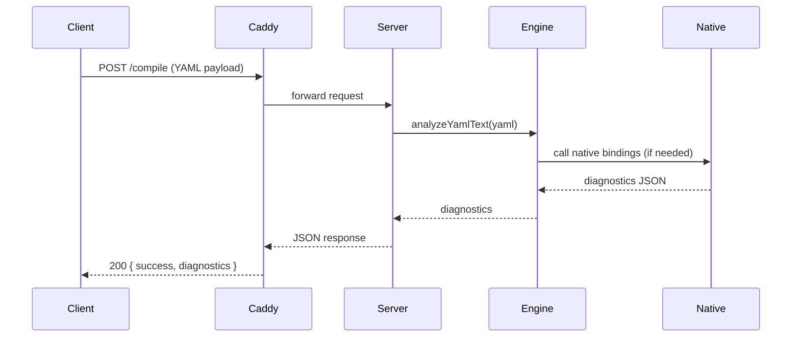

## D.A.A.L — Project Presentation

### Status
- Project name: D.A.A.L (`krishna-project`)
- Current build: tests passing (`npm test` -> OK (4 tests))
- Server: `src/js/server.js` responds to POST /compile when running under systemd behind Caddy
- Published artifacts: npm package `krishna-project@1.0.0`, VS Code extension `krishnapandey.krishna-project` v0.1.0

---

### Short Description

D.A.A.L (Diagnostics for Kubernetes YAML) is a small toolset that provides static analysis/diagnostics for Kubernetes YAML files. It includes:
- A Node.js analysis engine (pure JS and native addon built from `src/c/` via `node-gyp`)
- An HTTP server (`src/js/server.js`) exposing `POST /compile`
- A CLI (`src/js/cli.js`) for local scanning
- A VS Code extension (`vscode-extension/`) for in-editor diagnostics

---

### Project Health / Completion Checklist
- Unit tests: passing
- Server: can be run locally and is running on the VM (reverse proxied by Caddy)
- Packaging: npm package published; VSIX packaged and published to Marketplace
- CI: workflow file present at `.github/workflows/publish-on-release.yml` but repository secrets need to be added to enable automated publish

Conclusion: the project is functionally complete for a first release. Recommended cleanups and automation (below) will make it production-ready.

---

### How to add GitHub repository secrets (for Actions)
1. Go to your repository on GitHub: `https://github.com/<owner>/<repo>`
2. Click `Settings` → `Secrets and variables` → `Actions` → `New repository secret`
3. Add the following secrets (example names used in workflows):
   - `NPM_TOKEN`: a scoped npm automation token that allows `publish` (create it at https://www.npmjs.com/settings/<your-account>/tokens)
   - `VSCE_PAT`: a Personal Access Token (or publisher token) used by `vsce` to publish the extension
4. In your GitHub Actions workflow, reference these secrets as `secrets.NPM_TOKEN` and `secrets.VSCE_PAT`.

Notes:
- Generate tokens with the least privileges required and enable expiration/rotation.
- If your npm org enforces 2FA, create a token that can be used by automation (a CI token) rather than an OTP.

---

### How to run locally (dev)
1. Install deps: `npm install`
2. Build native addon: `npm run build` (runs `node-gyp rebuild`)
3. Start server: `npm start` (starts `src/js/server.js`)
4. Run CLI checks: `node src/js/cli.js <file-or-directory>`
5. Run tests: `npm test`

---

### Recommended repo cleanups (do these now)
```bash
git rm --cached vscode-extension/*.vsix || true
git rm --cached *.tgz || true
echo "vscode-extension/*.vsix" >> .gitignore
echo "*.tgz" >> .gitignore
git add .gitignore
git commit -m "chore: remove packaged artifacts from repo"
git push origin main
```

---

### Member-wise Roles (4 members — replace placeholders with real names)

- Lead Engineer: <Name A>
  - Technical lead, release manager, code reviews, coordinates architecture decisions
- Backend / Engine Developer: <Name B>
  - Maintains `src/js/engine`, native bindings (`src/c/`), performance and correctness of analysis
- DevOps / Infra: <Name C>
  - Manages VM deployment, systemd unit, Caddy config, TLS, CI/CD workflows and secrets
- QA / Docs / Extension: <Name D>
  - Tests, writes documentation, packages & publishes VS Code extension, user support

Each member should have a GitHub username recorded in the repo `CONTRIBUTORS.md` (optional) and be assigned issues for their domain.

---

### Architecture (HLD) — Mermaid

```mermaid
graph LR
  A[Client / CLI / VSCode] -->|HTTP POST /compile| B[Caddy (reverse proxy)]
  B --> C[daal systemd service]
  C --> D[Node.js server (src/js/server.js)]
  D --> E[Engine (src/js/engine)]
  E --> F[Native addon -> C sources (src/c/*)]
  D --> G[Storage/Logs]
  H[GitHub] -->|CI trigger| I[GitHub Actions]
  I -->|publish| J[NPM & VS Marketplace]

  style A fill:#f9f,stroke:#333,stroke-width:1px
  style B fill:#bbf,stroke:#333
  style C fill:#bfb,stroke:#333
  style D fill:#ffd,stroke:#333
  style E fill:#fcf,stroke:#333
```

---

### Sequence (LLD) — Mermaid



---

### CI / Publish flow
- Push tag or create GitHub Release → GitHub Actions triggers `publish-on-release.yml`
- Actions job uses `secrets.NPM_TOKEN` and `secrets.VSCE_PAT` to publish to npm and the VS Code Marketplace

---

### Next actions I can do for you now
- Remove committed artifacts and push the cleanup commit
- Add `PRESENTATION.md` to the repo (this file is added locally now)
- Create a `CONTRIBUTORS.md` template with GitHub handles and assign roles
- Add a simple `Dockerfile` and CI step to build and smoke-test the server

Please tell me which of the next actions you'd like me to run now (I can remove artifacts and commit, add CONTRIBUTORS.md, or scaffold Dockerfile + CI).
